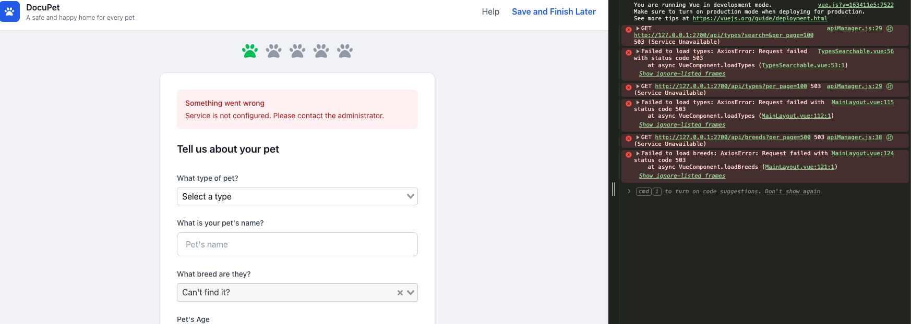

# DocuPet - Pet Registration Application

A Laravel-based pet registration application that demonstrates multiple frontend approaches (Vue.js SPA and Blade templates) with a clean architecture using the Repository Pattern, Service Layer, and Traits.

## Table of Contents

- [Project Overview](#project-overview)
- [Installation](#installation)
  - [Docker (Recommended)](#docker-recommended)
  - [Local Development](#local-development)
- [Frontend Approaches](#frontend-approaches)
  - [Vue.js SPA Path](#vuejs-spa-path)
  - [Blade Templates Path](#blade-templates-path)
  - [Comparison](#comparison)
- [API Endpoints](#api-endpoints)
  - [API Protection](#api-protection)
- [Project Structure](#project-structure)
- [Architecture & Patterns](#architecture--patterns)
- [Testing](#testing)

---

## Project Overview

DocuPet allows users to register their pets with the following information:
- Pet type (Dog, Cat, etc.)
- Pet name and gender
- Breed selection (with support for unknown/mixed breeds with custom description)
- Date of birth or approximate age

The application showcases two different frontend implementations sharing the same backend API and business logic.

### Demo

<video src="screenshots/docupet-demo.webm" controls width="100%">
  Your browser does not support the video tag.
</video>

*If the video doesn't play above, [download the demo video](screenshots/docupet-demo.webm).*

---

## Installation

### Docker (Recommended)

Docker provides the easiest setup and works on **macOS**, **Linux**, and **Windows**.

**Prerequisites:**
- [Docker](https://docs.docker.com/get-docker/) and [Docker Compose](https://docs.docker.com/compose/install/) (Docker Desktop includes both)

**Quick Start:**

```bash
# Clone the repository (HTTPS)
git clone https://github.com/evan7diab/docupet-code-challenge.git

# Or clone via SSH
git clone git@github.com:evan7diab/docupet-code-challenge.git

cd docupet-code-challenge

# Build and start the application
docker compose up -d --build

# The app will be available at:
# - Home: http://localhost:8000
# - Vue App: http://localhost:8000/vue-app
# - Blade Form: http://localhost:8000/pet-owner/register
```

**What Docker Does:**
- Builds the application image with PHP 8.2, Composer, and Node.js
- Runs `npm run build` to compile frontend assets
- Starts MySQL 8.0 database
- Runs migrations and seeders automatically on startup

**Useful Commands:**

```bash
# View application logs
docker compose logs -f app

# Stop the application
docker compose down

# Stop and remove database volume (reset data)
docker compose down -v

# Rebuild after code changes
docker compose up -d --build
```

**Local Development with Docker:**

To mount your code and see changes without rebuilding:

1. Add volume mount in `docker-compose.yml` under `app` service:
   ```yaml
   volumes:
     - .:/var/www/html
   ```

2. Run `composer install` and `npm run build` on your host

3. Restart: `docker compose up -d`

### Local Development

**Prerequisites:**
- PHP 8.2+
- Composer
- Node.js 20+
- MySQL 8.0

**Setup:**

```bash
# Install PHP dependencies
composer install

# Install Node dependencies and build assets
npm install
npm run build

# Copy environment file
cp .env.example .env

# Configure your database in .env
# DB_CONNECTION=mysql
# DB_HOST=127.0.0.1
# DB_PORT=3306
# DB_DATABASE=docupet
# DB_USERNAME=root
# DB_PASSWORD=

# Generate application key
php artisan key:generate

# Run migrations and seeders
php artisan migrate --seed

# Start development server
php artisan serve
```

---

## Frontend Approaches

### Vue.js SPA Path

**URL:** `/vue-app`

A single-page application built with Vue.js that:
- Fetches data dynamically via API calls
- Provides a reactive, modern user experience
- Uses searchable dropdowns for type and breed selection
- Submits pet registration via the API

**Key Files:**
- `resources/js/app.js` - Vue app entry point
- `resources/js/layouts/RegistrationForm.vue` - Main registration form
- `resources/js/layouts/Review.vue` - Review step before submission
- `resources/js/components/` - Reusable Vue components
- `resources/js/mixins/petPayloadMixin.js` - Form to API payload mapping

### Blade Templates Path

**URL:** `/pet-owner/register`

A traditional server-rendered form using Laravel Blade templates that:
- Loads all data server-side (types, breeds)
- Uses standard HTML form submission
- Validates via Laravel Form Requests
- Provides a simpler, JavaScript-minimal approach

**Key Files:**
- `resources/views/blades/pet-owner-form.blade.php` - Registration form template
- `app/Http/Controllers/PetOwnerRegistrationController.php` - Form controller
- `app/Http/Requests/PetSaveRequest.php` - Form validation rules

### Comparison

| Feature | Vue.js SPA | Blade Templates |
|---------|-----------|-----------------|
| Data Loading | API calls (async) | Server-side (sync) |
| Form Submission | API POST | Traditional form POST |
| User Experience | Dynamic, reactive | Page reloads |
| JavaScript Required | Yes | Minimal |
| SEO | Requires SSR | Native |
| Complexity | Higher | Lower |

---

## API Endpoints

All API routes are prefixed with `/api`.

| Method | Endpoint | Description |
|--------|----------|-------------|
| GET | `/api/types` | List all pet types (paginated) |
| GET | `/api/breeds` | List all breeds (supports `?type_id=` filter, paginated) |
| POST | `/api/pets` | Register a new pet |

### API Protection

API endpoints are protected by an API key middleware (`EnsureApiKey`).

**Authentication:**

Use the `X-API-Key` header:

```bash
curl -H "X-API-Key: your-api-key" http://localhost:8000/api/types
```

**Configuration:**

The API key is configured via the `API_KEY` environment variable. In Docker, this is set in `docker-compose.yml`:

```yaml
environment:
  API_KEY: docupet-api-key-secret
```

For local development, add to your `.env` file:

```env
API_KEY=your-secret-api-key
```

**Error Responses:**

- `401 Unauthorized` - Invalid or missing API key
- `503 Service Unavailable` - API key not configured on server

**Screenshot: API Key Not Configured (503 Error)**

When the API key is not configured on the server, the Vue app will display an error:



---

## Project Structure

```
Docupet/
├── app/
│   ├── Http/
│   │   ├── Controllers/
│   │   │   ├── Api/                    # API controllers
│   │   │   │   ├── BreedController.php
│   │   │   │   ├── PetController.php
│   │   │   │   └── TypeController.php
│   │   │   ├── PetOwnerRegistrationController.php  # Blade form controller
│   │   │   └── VueAppController.php    # Vue app container
│   │   ├── Middleware/
│   │   │   └── EnsureApiKey.php        # API key authentication
│   │   └── Requests/
│   │       └── PetSaveRequest.php      # Form validation with localized messages
│   ├── Models/                         # Eloquent models with business logic
│   │   ├── Breed.php
│   │   ├── Pet.php                     # Includes static helper methods
│   │   └── Type.php
│   ├── Providers/
│   │   └── AppServiceProvider.php      # Repository bindings
│   ├── Repositories/                   # Data access layer
│   │   ├── BreedRepository.php
│   │   ├── BreedRepositoryInterface.php
│   │   ├── PetRepository.php           # Handles form-to-model transformation
│   │   ├── PetRepositoryInterface.php
│   │   ├── TypeRepository.php
│   │   └── TypeRepositoryInterface.php
│   ├── Services/                       # Thin orchestration layer
│   │   ├── BreedService.php
│   │   ├── PetOwnerRegistrationService.php
│   │   └── TypeService.php
│   └── Traits/                         # Reusable traits
│       └── NormalizesPagination.php    # Pagination normalization
├── config/
│   └── pagination.php                  # Pagination settings (env-based)
├── database/
│   ├── migrations/                     # Database schema
│   └── seeders/                        # Sample data
├── lang/
│   └── en/
│       └── messages.php                # Localized messages
├── resources/
│   ├── js/                             # Vue.js frontend
│   │   ├── api/
│   │   │   └── apiManager.js           # API client
│   │   ├── components/                 # Vue components
│   │   ├── layouts/                    # Page layouts
│   │   ├── mixins/                     # Reusable Vue mixins
│   │   └── app.js                      # Vue entry point
│   └── views/
│       ├── blades/                     # Blade templates
│       └── vue/                        # Vue container
├── routes/
│   ├── api.php                         # API routes
│   └── web.php                         # Web routes
├── docker-compose.yml                  # Docker services
├── Dockerfile                          # App container
└── docker-entrypoint.sh                # Container startup
```

---

## Architecture & Patterns

### Repository Pattern

The application uses the Repository Pattern to abstract data access and handle data transformation.

**Structure:**
- **Interface** - Defines the contract for data operations
- **Implementation** - Handles data access and form-to-model transformation
- **Binding** - Interfaces are bound to implementations in `AppServiceProvider`

**Example (PetRepository):**

```php
class PetRepository implements PetRepositoryInterface
{
    public function create(array $data): Pet
    {
        $breedId = $data['breed_id'] ?? null;
        $breedText = Pet::resolveBreedText($breedId, $data);

        $petData = [
            'type_id' => $data['type_id'],
            'name' => trim($data['name']),
            'sex' => $data['gender'],  // Form uses 'gender', model uses 'sex'
            'breed_id' => $breedId,
            'breed_text' => $breedText,
            'breed_unknown' => Pet::isBreedUnknown($breedId, $breedText),
            'is_dangerous' => Pet::resolveIsDangerous($breedId),
            // ...
        ];

        return $this->model->newQuery()->create($petData);
    }
}
```

### Model Static Helpers

Domain logic for resolving field values lives in the Model as static methods.

```php
class Pet extends Model
{
    // Resolve breed text for mixed breeds
    public static function resolveBreedText(?int $breedId, array $data): ?string

    // Determine if breed is unknown (no breed_id and no breed_text)
    public static function isBreedUnknown(?int $breedId, ?string $breedText): bool

    // Lookup is_dangerous flag from related Breed
    public static function resolveIsDangerous(?int $breedId): bool
}
```

### Service Layer

Services are thin orchestration layers that delegate to repositories. Business logic lives in Models and Repositories.

```php
class PetOwnerRegistrationService
{
    public function __construct(
        private PetRepositoryInterface $petRepository
    ) {}

    public function savePet(array $data): Pet
    {
        return $this->petRepository->create($data);
    }
}
```

### Reusable Traits

Common functionality is extracted into traits for reuse across services.

```php
trait NormalizesPagination
{
    private function normalizePerPage(?int $perPage): int
    {
        $default = config('pagination.default_per_page');
        $min = config('pagination.min_per_page');
        $max = config('pagination.max_per_page');

        $perPage = $perPage ?? $default;

        return min(max($perPage, $min), $max);
    }
}
```

### Environment-Based Configuration

Application settings are configurable via `.env` without code changes.

```php
// config/pagination.php
return [
    'default_per_page' => (int) env('PAGINATION_DEFAULT_PER_PAGE', 15),
    'min_per_page' => (int) env('PAGINATION_MIN_PER_PAGE', 1),
    'max_per_page' => (int) env('PAGINATION_MAX_PER_PAGE', 100),
];
```

### Localization

All user-facing messages use Laravel's localization system for easy maintenance and i18n support.

```php
// lang/en/messages.php
return [
    'pet' => [
        'registered' => 'Pet ":name" has been registered.',
    ],
    'validation' => [
        'type_id' => [
            'required' => 'Please select a pet type.',
        ],
    ],
];

// Usage
__('messages.pet.registered', ['name' => $pet->name])
```

### Form Request Validation

Laravel Form Requests encapsulate validation rules with localized messages.

```php
class PetSaveRequest extends FormRequest
{
    public function rules(): array
    {
        return [
            'type_id' => 'required|exists:types,id',
            'name' => 'required|string|max:255',
            'breed_text' => 'nullable|string|max:255',
            // ...
        ];
    }

    public function messages(): array
    {
        return [
            'type_id.required' => __('messages.validation.type_id.required'),
            // ...
        ];
    }
}
```

### Dependency Injection

The application leverages Laravel's IoC container:

- Controllers receive Services via constructor injection
- Services receive Repositories via constructor injection
- Bindings are configured in `AppServiceProvider`

This enables loose coupling and facilitates unit testing.

---

## Testing

### Running Tests

The application uses PHPUnit for testing. Tests are organized into Unit and Feature tests.

```bash
# Run all tests
php artisan test

# Run with verbose output
php artisan test -v

# Run specific test file
php artisan test tests/Unit/PetModelTest.php

# Run specific test method
php artisan test --filter test_saves_pet_with_known_breed

# Run with coverage report (requires Xdebug or PCOV)
php artisan test --coverage
```

### Test Structure

```
tests/
├── Feature/
│   ├── Api/
│   │   ├── TypeApiTest.php      # /api/types endpoint tests
│   │   ├── BreedApiTest.php     # /api/breeds endpoint tests
│   │   └── PetApiTest.php       # /api/pets endpoint tests
│   └── ExampleTest.php
└── Unit/
    ├── PetOwnerRegistrationServiceTest.php  # Service layer tests
    ├── PetModelTest.php                     # Model static methods & accessors
    ├── EnsureApiKeyMiddlewareTest.php       # API authentication middleware
    ├── NormalizesPaginationTraitTest.php    # Pagination trait tests
    └── ExampleTest.php
```

### Code Style (PSR-12)

The project uses [Laravel Pint](https://laravel.com/docs/pint) for code style enforcement (PSR-12).

```bash
# Check for code style violations (without fixing)
composer pint:test

# Or using vendor binary directly
./vendor/bin/pint --test

# Fix code style violations automatically
composer pint

# Or using vendor binary directly
./vendor/bin/pint

# Check specific directory
./vendor/bin/pint --test app/Http/Controllers
```

---

## License

This project is open-sourced software licensed under the [MIT license](https://opensource.org/licenses/MIT).
